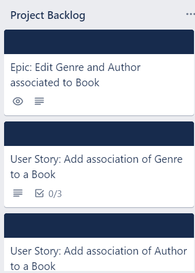
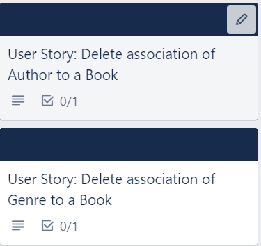
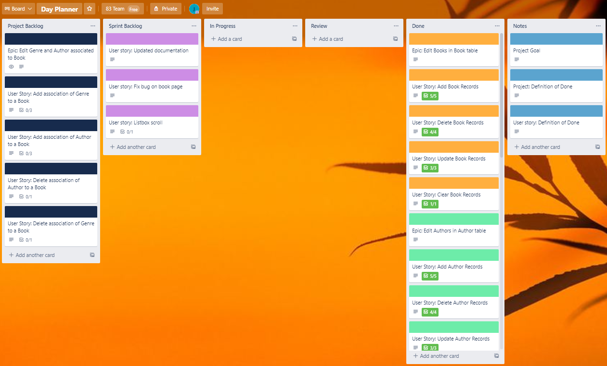
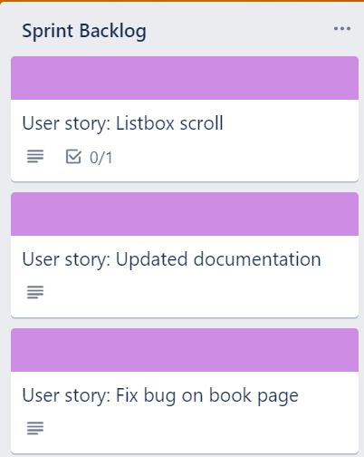
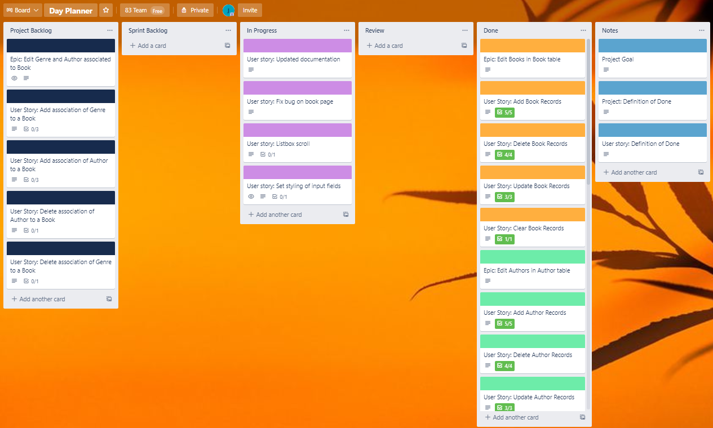
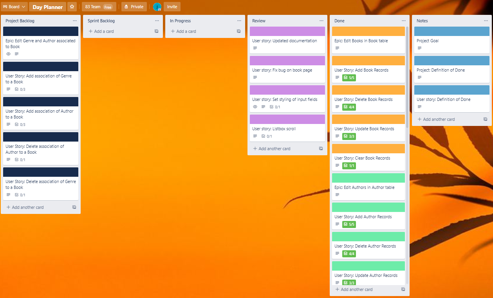
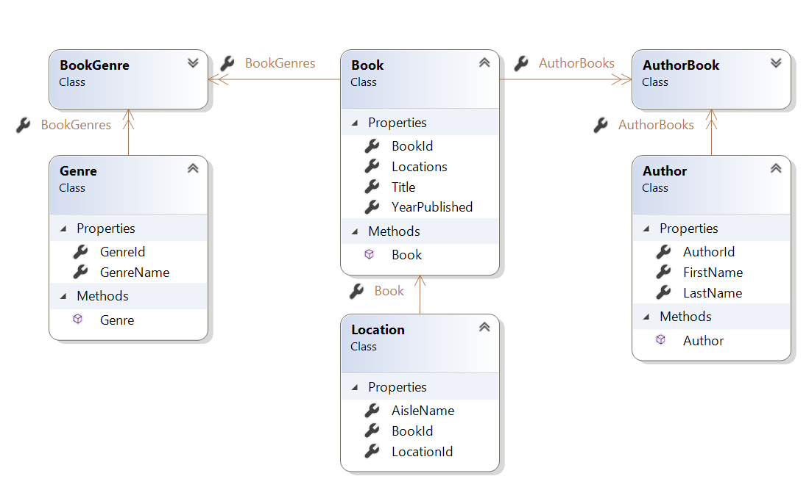
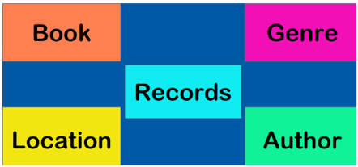
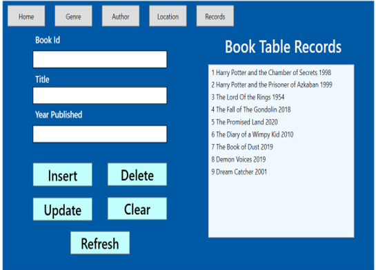
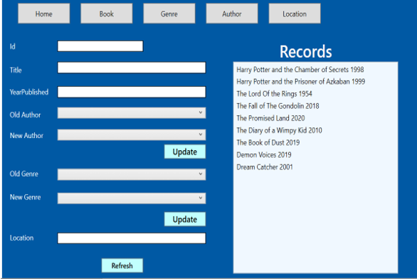

# ReadMe

### Project Goal

Create a Library Management System that allows you to store and update records of Books, Authors, Genres and Locations.
The book records should display the assoicated authors, genres and location.

### Project Backlog
1.	Create tables and generate classes using Db-First approach
2.  Write tests for CRUD per table
3.  Create CRUD methods in classes(each class associated to a table)
4.  Construct GUI pages per class(Books, Genres, Auhtors, Location)
5.  Add functionality to View/ Insert/ Update/ Delete Book records 
6.	Add functionality to View/ Insert/ Update/ Delete Author records 
7.	Add functionality to View/ Insert/ Update/ Delete Genre records 
8.	Add functionality to View/ Insert/ Update/ Delete Location records 
9.	Add functionality to View/ Insert/ Update/ Delete Books and their associated Genres, Authors, Location. 

The outstanding item left in the Project backlog is item 9 where the insert and delete functionality was not completed for the assoicate genre and authors.
Items 1-8 have been moved into Done after the sprint review.

### User-story Definition of Done
* CRUD functionality is working
* Unit Tests for CRUD are passing
* Acceptance criteria is met
* Documentation is up to date
* GUI is working as intended

### Output of Sprint Review
##### Done:
* GUI application had working CRUD functionaliy for each of the pages.
* Tests for CRUD operations per page were passing.
* All items in Sprint backlog for Sprint1 had been transferred from Review to done.
* Most sprint goals shown as user stories were met during Sprint1.

##### Sprint2 Goals:
For this sprint the items in the sprint backlog are:

1. Changes to TextBox input fields font size and background colour.
2. Listbox scroll to be added.
3. Bug to be fixed on update title.
4. Homepage buttons need to be in line with each other. 
5. Up-to-date documentation and trello board.

### Sprint Retrospective

##### What went well: 
* I was able to produce my intended outcome within the time frame given.
* I could reach out to my colleagues during periods where I was hitting blockers.
* Being organised and distributing time to each layer effectively was a strength in this project.

##### Improvements:
1. Update the documentation as I go along (quick notes)
2. Have a trello board set up with user stories beforehand
3. Create wireframes so structure/ layout is clear before designing wpf.

##### Actions:
For the next sprint I would like to have my trello board with epics and user stories ahead of the Sprint so that I have clear outcomes outlined
and it is easier to follow what tasks are outstanding.

In the next sprint I am going to keep my documentation up to date.

### Trello Board
This is my trello board after the Sprint1 Review

This is my trello board during Sprint 2.

This is the trello board ready for Sprint Review.

[View Trello Board](https://trello.com/b/ED0l1XcJ/day-planner)
- The trello board mainly consists of Epics and User Stories.
- Within the user stories you will find the acceptance criteria.

### Class Diagram
Here is a class diagram of the tables and their relationships.

-Author - Book had a many to many relationship, broken down into 1 to many relationship using the AuthorBooks table.

-Genre - Book had a many to many relationship, broken down into 1 to many relationship using the BookGenres table.

-Location - Book has a 1 to 1 relationship.
This Diagram can be found in the project folder under LibraryData layer (folder).

### Overall Project Retrospective

##### I have learned how to:
- Integrate the 3 layers together in terms of Business, Data, WPF application.
- Able to use Db-First approach and break down many to many relationships using join tables
- Use linq query and method query syntax to retrieve results from the tables.

##### Next time I would: 
- Have a basic functioning WPF application while constructing the Business and Test layer.
- Have clearly defined acceptance criteria at the beginning so I can do research on how to meet those goals before hand.
- Not let blockers consume a lot of my time, instead come back to it with a fresh mind.

# User Guide
1. You can start the application by selecting LibraryWPF from the dropdown list and clicking the play button adjacent to it.

2. Next select what page you want to view.

3. This is an example of the Book page. All pages have similar layouts and functionality so it is easy to navigate around the application.

- _**Update details of a book:**_ Select a record from the list. Amend the details. Id field is read-only. Then click update.

* _**Insert a book:**_ Click Insert. Fill in the book and year published (both fields required). Click save. Click Refresh to see new record in list.

* _**Delete a book:**_ Select a record so the text boxes are populated. Then click delete.

* _**Clear a textbox:**_ If you have previously selected an item you can clear the texbox by clicking Clear.

* _**Navigate to pages:**_ Click on the name of the pages at the top to view different pages.

4. This is the records page, where you can view the associated Genre, Author, Location of a book.

- _**Update author of a book:**_ Select an author from the Old Authors dropdown, select a new author in the dropdown below. 
Click update. The click Refresh when you see the prompt.

You can repeat the same steps with Old Genres and New Genres to update an existing genre.
